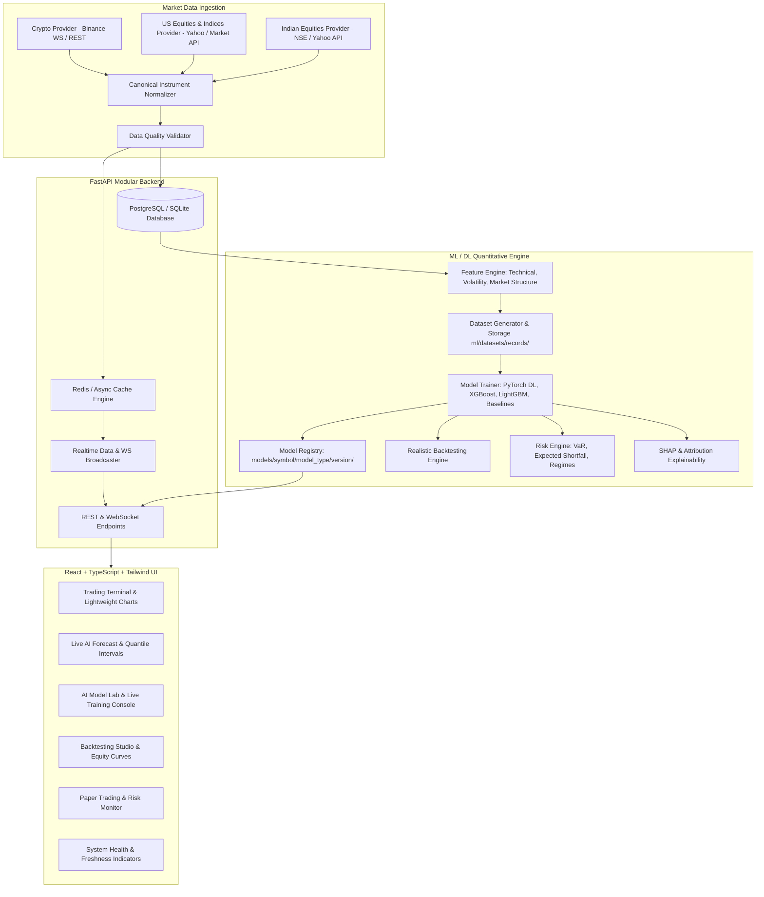

# Implementation Plan - Institutional-Grade AI/ML/DL Stock & Crypto Market Prediction Platform

Build a complete, production-grade quantitative market prediction and research platform supporting real-time data streaming, modular multi-market data providers, leak-free feature engineering, ML & PyTorch Deep Learning training, model artifact & dataset storage in dedicated folders, explainability (SHAP), realistic backtesting, risk analysis, paper trading, and an institutional trading-terminal React frontend.

## User Review Required

> [!IMPORTANT]
> - **Real-time Market Data Providers**: Public live WebSocket data for Crypto (Binance/Coinbase) connects out of the box with zero keys. US & Indian Equities/Indices use Yahoo Finance / public market APIs with automated real-time polling and historical OHLCV feeds, with pluggable support for Alpha Vantage, Finnhub, and Polygon via `.env`.
> - **Dataset & Model Artifact Storage**: As requested, every trained model will have its training dataset, scaler, feature configuration, metrics, and model weights cleanly stored in dedicated folders under `ml/datasets/records/<dataset_id>/` and `models/<symbol>/<model_type>/<version>/`.
> - **Strict No-Fake-Data Enforcement**: The entire backend and frontend strictly report real market ticks, real model predictions, real training curves, and real backtest results. When unconfigured or waiting for training, clear status badges (`LIVE`, `STALE`, `NOT CONFIGURED`, `MODEL NOT TRAINED`) will be displayed.

---

## Architecture Overview

---

## Proposed Changes

### 1. Backend Core & Market Data Ingestion
- `backend/core/config.py`: Environment configuration and Pydantic settings.
- `backend/core/database.py`: SQLAlchemy async engine and session management (PostgreSQL with SQLite fallback for immediate out-of-the-box local testing).
- `backend/models/schema.py`: Relational database models (`Instrument`, `MarketData`, `Candle`, `Tick`, `DatasetRecord`, `ModelRegistry`, `TrainingRun`, `BacktestRun`, `PaperOrder`, `PaperPosition`, `AuditLog`, `SystemEvent`).
- `backend/market_data/base.py`: Abstract `MarketDataProvider` interface.
- `backend/market_data/crypto.py`: Binance WebSocket & REST provider (live tick & kline streaming for BTC/USDT, ETH/USDT, SOL/USDT, etc.).
- `backend/market_data/us_stocks.py`: US stocks and indices (AAPL, MSFT, NAS100, US30) real-time polling & historical provider.
- `backend/market_data/indian_stocks.py`: Indian stocks and indices (RELIANCE, TCS, NIFTY50, BANKNIFTY) provider.
- `backend/market_data/normalizer.py`: Canonical symbol mapping (`CRYPTO_BTCUSDT`, `US_EQ_AAPL`, `IN_EQ_RELIANCE`, `INDEX_NAS100`).
- `backend/market_data/validator.py`: Data quality checks (OHLC validation, missing candles, negative prices, outlier detection, timestamps).
- `backend/market_data/streamer.py`: Async background worker that ingests live market data and broadcasts updates to Redis / WebSockets.

### 2. Machine Learning, Deep Learning & Dataset Storage
- `ml/features/technical.py`: Complete library of indicators (SMA, EMA, WMA, VWAP, RSI, MACD, Stochastic, CCI, ROC, Williams %R, ATR, Parkinson Volatility, Garman-Klass, OBV, MFI, Volume Ratios, Gap, Momentum).
- `ml/features/market_features.py`: Market-specific features (India VIX, US VIX, Treasury yields proxy, BTC Dominance, ETH/BTC ratio).
- `ml/datasets/generator.py`: Time-series dataset generation with strict leakage prevention (walk-forward splits, scalers fit strictly on training set only).
- `ml/datasets/storage.py`: Dedicated dataset persistence saving every training dataset to `ml/datasets/records/<dataset_id>/` with metadata, target definitions, and feature matrix.
- `ml/models/baseline.py`: Naive forecast, Random Walk, Moving Average, Linear Regression.
- `ml/models/tree_models.py`: XGBoost & LightGBM implementations with hyperparameter tuning & SHAP feature importances.
- `ml/models/pytorch_models.py`: PyTorch Deep Learning architectures:
  - **LSTM**: Multi-layer LSTM with residual connections.
  - **GRU**: Gated Recurrent Unit sequence model.
  - **CNN-LSTM**: 1D Convolutional feature extractor + LSTM temporal encoder.
  - **Transformer**: Multi-head self-attention Time-Series Transformer.
  - Support for multi-horizon forecast, expected returns, direction classification (UP/DOWN/SIDEWAYS), and quantile prediction intervals (10th, 25th, 50th, 75th, 90th percentile).
- `ml/models/ensemble.py`: Stacking, Blending, and Performance-Weighted Probability Averaging.
- `ml/training/trainer.py`: Complete training pipeline with early stopping, learning rate schedulers, checkpointing, and live WebSocket progress callbacks.
- `ml/training/hyperopt.py`: Optuna hyperparameter optimization.
- `ml/evaluation/metrics.py`: Regression metrics (MAE, RMSE, MAPE, SMAPE, R²), Classification metrics (Accuracy, Precision, Recall, F1, ROC-AUC, Brier Score, LogLoss), and Calibration (Platt / Isotonic regression).
- `ml/backtesting/engine.py`: Realistic backtesting simulation including commission, slippage, spread, stop-loss, take-profit, position sizing, Sharpe/Sortino ratios, and drawdown analysis vs Buy & Hold.
- `ml/risk/engine.py`: Value-at-Risk (Parametric & Historical VaR), Expected Shortfall (CVaR), volatility analysis, correlation matrix, and Market Regime detection (trend/volatility clustering).
- `ml/registry/registry.py`: Model governance saving model weights, scalers, configs, and training metrics in `models/<symbol>/<model_type>/<version>/`.

### 3. FastAPI REST & WebSocket APIs
- `backend/api/v1/assets.py`: Instrument discovery, search, and market status.
- `backend/api/v1/market.py`: Live price snapshots, tick feeds, and historical OHLCV.
- `backend/api/v1/predictions.py`: Real-time AI prediction, prediction intervals, SHAP feature importance, and historical prediction log.
- `backend/api/v1/models.py`: Model registry, model comparisons, versions, and metrics.
- `backend/api/v1/training.py`: Model training launcher, active training job status, and epoch logs.
- `backend/api/v1/datasets.py`: Dataset records inspection and metadata.
- `backend/api/v1/backtests.py`: Backtesting execution and historical performance reports.
- `backend/api/v1/portfolio.py`: Paper trading portfolio, order submission, open positions, and P&L.
- `backend/api/v1/system.py`: System health (API, DB, Redis, data provider status, latencies).
- `backend/websocket/routes.py`: High-frequency WebSockets (`/ws/market`, `/ws/predictions`, `/ws/training`, `/ws/system`).
- `backend/main.py`: FastAPI app entrypoint, CORS, lifespan handlers, background streaming manager.

### 4. CLI Execution Tools
- `train.py`: CLI command for training models on any symbol/timeframe (e.g., `python train.py --symbol BTCUSDT --model lstm --epochs 20`).
- `evaluate.py`: CLI tool for evaluating trained models and printing comprehensive metrics.
- `backtest.py`: CLI tool for running backtest simulations and displaying equity statistics.
- `predict.py`: CLI tool for running instant real-time inference on the latest live market data.

### 5. Institutional Trading-Terminal Frontend (React + Vite + TypeScript + Tailwind CSS)
- **Design System & Theme**: Sleek dark institutional terminal (Bloomberg/TradingView style) with glowing status indicators, dense data tables, crisp typography, and fluid micro-animations.
- **Components**:
  - `TradingChart.tsx`: High-performance TradingView Lightweight Chart with candlestick series, volume histogram, moving average overlays, and predicted price trajectory / confidence cones.
  - `TickerHeader.tsx`: Real-time ticker banner with symbol selector, live price, 24h change, provider name, data age, and status badges (`LIVE`, `STALE`, `DISCONNECTED`).
  - `PredictionPanel.tsx`: Direction gauge (UP/DOWN/SIDEWAYS), expected return, calibrated confidence %, 10%-90% quantile prediction intervals, and SHAP feature importance chart.
  - `ModelLab.tsx`: Interactive model training studio with model type selector (LSTM, GRU, Transformer, XGBoost, LightGBM), dataset configurator, hyperparameter sliders, live training loss curve via WebSocket, and model leaderboard.
  - `BacktestStudio.tsx`: Quantitative backtester with customizable capital, commission, stop-loss/take-profit, interactive equity curve vs Buy & Hold, trade log, and metrics (Sharpe, Sortino, MaxDD, Win Rate).
  - `PaperTrading.tsx`: Paper trading execution widget, order book / quick buy-sell, open positions table, and real-time P&L tracking.
  - `RiskRegimePanel.tsx`: Market Regime detector (Bull, Bear, Sideways, High Volatility), VaR (95% & 99%), and Expected Shortfall gauge.
  - `SystemHealthModal.tsx`: System health diagnostic dashboard checking backend status, database, Redis, provider connectivity, and latency.

### 6. Deployment & Testing
- `docker-compose.yml`: Multi-container setup (FastAPI backend, React frontend, PostgreSQL, Redis).
- `Dockerfile.backend` & `Dockerfile.frontend`.
- `requirements.txt`: Curated, compatible Python dependencies (`torch`, `xgboost`, `lightgbm`, `optuna`, `shap`, `fastapi`, `uvicorn`, `websockets`, `sqlalchemy`, `yfinance`, `pandas`, `numpy`, `scipy`, `scikit-learn`, `pytest`).
- `tests/`: Complete unit and integration test suite (`test_features.py`, `test_data_validation.py`, `test_leakage_prevention.py`, `test_models.py`, `test_backtest.py`, `test_api.py`).
- `README.md`: Comprehensive documentation with exact commands for installation, startup, training, inference, backtesting, and verification.

---

## Verification Plan

### Automated Tests
1. **Unit & ML Integrity Tests**:
   - `python -m pytest tests/`
   - Validates feature calculations, data validation edge cases, scaler leakage prevention, time-series splitting integrity, PyTorch model forward passes, XGBoost training, and backtesting math.
2. **CLI Commands Execution**:
   - `python train.py --symbol BTCUSDT --model xgboost --timeframe 1h`
   - `python train.py --symbol BTCUSDT --model lstm --timeframe 1h --epochs 5`
   - `python predict.py --symbol BTCUSDT`
   - `python backtest.py --symbol BTCUSDT --model xgboost`
3. **Frontend Build & Linting**:
   - `cd frontend && npm.cmd run build`

### Manual & Interactive Verification
1. **Live Market Ingestion**: Start backend and verify real-time crypto ticks streaming over WebSocket without page refresh.
2. **AI Model Lab**: Launch a live training run from the UI and observe live epoch loss curves streaming over WebSocket.
3. **Dedicated File Verification**: Verify that training records are saved under `ml/datasets/records/<dataset_id>/` and trained models are stored in `models/<symbol>/<model_type>/<version>/`.
4. **Backtest & Paper Trading**: Execute a backtest simulation and test placing a paper order with live position tracking.
